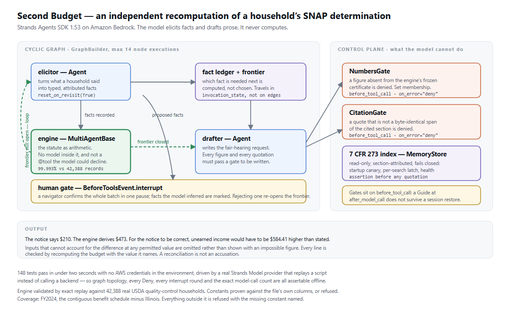

# Second Budget

An independent second opinion on a household's SNAP determination.

A benefits navigator sits with a household holding a notice of action. The
household asks the only question that matters: *is this number right?* Today the
honest answer is that nobody checks. Second Budget re-derives the allotment from
the underlying facts, and when it disagrees it says **which stage** of the budget
it disagrees with and by how much, with the regulation quoted verbatim.

**Status: in progress.** The engine, its validation against federal microdata,
the agent orchestration, the disagreement report and the regulation index are
built and measured. Still to come: the rendered fair-hearing packet and a CLI.
Every number below is reproducible from this repository.

## What is proven, not asserted

The engine is validated by exact replay against the USDA SNAP Quality Control
public-use microdata for FY2024 — 44,891 real, de-identified households that
carry both the inputs to the budget and the benefit that resulted.

The engine runs from raw components -- income, each deduction, shelter costs,
size, the applicable caps. **It never reads the file's net-income column**; net
income is derived. That is what makes this a test of the budget rather than of
one subtraction.

| stage | agreement |
| --- | ---: |
| excess shelter deduction | 42,386 / 42,388 = **99.995%** |
| total deductions | 42,386 / 42,388 = **99.995%** |
| net income | 42,383 / 42,388 = **99.988%** |
| **allotment** | **42,385 / 42,388 = 99.993%** |

Integer equality, no tolerance. The three remaining households are singletons,
not a pattern. Reproduce it:

```bash
python -m second_budget.validate.fetch_qc --year 2024
python -m second_budget.validate.layer_a_allotment
```

### The rules the microdata found

Every rule below was found by demanding an empty residual histogram against real
records, not by reading the regulation more carefully. A flat mismatch rate says
nothing; a residual that clusters on one value is a specific rule missing from
the code, and it names itself. A naive allotment formula scores 90.957%.

1. **−23 on 3,257 households.** The minimum benefit. Measured, not assumed: it
   applies only to household sizes 1 and 2, and it applies **even when the
   computed allotment is zero**, not merely when it is small. Of the affected
   households, every one has a computed allotment below the floor and none has
   one at or above it.
2. **The rounding sits before the subtraction.** 7 CFR 273.10(e)(2)(ii)(A)
   requires the household's 30% share to be rounded *up to the next whole dollar
   and then subtracted*, not the result rounded afterwards.
3. **The earned income deduction truncates.** 20% of earned income, rounded
   *down*. `floor` matches 99.955%; rounding to nearest matches 90.059%, missing
   low by exactly one dollar on 4,209 households.
4. **Adjusted income is rounded before it is halved**, not after. Halving first
   scores 74.502%.
5. **`round()` in Python is not `round()` in the regulation.** The built-in is
   banker's rounding, so `round(0.5) == 0`. Using it for the half-of-adjusted-
   income step scores **87.482%** on the excess shelter deduction where half-up
   scores 99.995% -- exactly 5,304 households wrong by a dollar, with no
   exception and nothing in the output to suggest it.
6. **A homeless household's flat shelter deduction replaces the excess-shelter
   stage rather than adding to it.** Implementing only half of that rule cost
   exactly `ceil(0.30 x 180) = 54` dollars on 38 households -- which is how it
   was found.

Worth stating plainly: the statute does not round consistently. The earned income
deduction truncates down, lowering the deduction; the household's share rounds
up, lowering the benefit. Both defaults fall the same way for the household, and
neither is the obvious reading.

### Does disagreement mean anything?

Measured over 43,299 households, comparing an independent recomputation against
the benefit actually received (`RAWBEN`) and against the federal reviewer's own
error findings:

|                      | reviewer found no error | reviewer found an error |
| -------------------- | ----------------------: | ----------------------: |
| **engine agrees**    |                  23,596 |                     204 |
| **engine disagrees** |                   2,585 |                  16,914 |

- Agreement → the reviewer found nothing in **99.14%** of cases.
- Disagreement → the reviewer found something in **86.74%** of cases.

```bash
python -m second_budget.validate.layer_b_localisation
```

**What this does not claim.** Agreement is measured; causation is not. A
reviewer's finding can rest on facts this file does not expose, and a
disagreement can equally be the engine's own limitation. Both error cells are
published above rather than summarised away.

### The constants are proven, not typed in and trusted

The maximum allotment, standard deduction, minimum benefit and excess-shelter cap
are transcribed from the published schedule (Tables F.3, F.5 and F.6 of the
FY2024 SNAP QC Technical Documentation, sourced there to USDA FNS) and then
checked **per household** against the microdata's own columns.

| constant | column | agreement |
| --- | --- | ---: |
| minimum benefit | `MINIMUM_BEN` | **100.000%** |
| excess shelter cap | `SHELCAP` | **100.000%** |
| standard deduction | `FSSTDDED` | 99.990% |
| maximum allotment | `BENMAX` | 99.984% |

```bash
python -m second_budget.validate.layer_c_constants
```

The direction matters. A table read off the data and then checked against that
same data is not evidence; two independent expressions of one schedule agreeing
on 42,438 households is. And every one of the 11 residual households explains
itself: in each, the recorded constant is this table's own value for a *different*
household size, so the disagreement is between two columns of the microdata, not
between the microdata and the table. The report says so rather than rounding it
away.

**Illinois is not covered, and that is the interesting part.** All 861 Illinois
households carry a standard deduction exactly $7 below the published contiguous
figure, at every size band — 861 of 861 is a rule, not noise. No published source
for the variation has been located, so Illinois is refused rather than having
`191` copied out of the microdata. A table fitted to the data it is checked
against has stopped being evidence.

Refusal is a shipped feature with its own tests. Asked about an Illinois
household, the system says:

> standard deduction is not available for Illinois: every Illinois household in
> the FY2024 file has a standard deduction $7 below the published contiguous
> schedule, and no published source for that variation has been located; the
> engine refuses rather than using an unsourced figure or one copied out of the
> data it would be checked against.

Alaska is refused for a different reason: it runs three separate benefit
schedules and the public-use file records only the state, so an Alaskan household
cannot be mapped to its schedule from the data available. Falling back to the
contiguous figure would produce an answer that is plausible, wrong, and
indistinguishable from a right one — which is the failure this project exists to
attack.

## How it is built




    elicitor  ->  engine  ->  frontier still open?  ->  elicitor  ->  ...
                     |
                     +-------- frontier closed ---->  drafter

**The engine is a graph node, not a tool.** A `@tool` is something a model
chooses to call, chooses arguments for, and can decline. The budget is a statute
compiled to arithmetic, so it is a `MultiAgentBase` peer node that the graph
simply runs. The model in this system elicits facts and drafts prose. It never
computes.

**The loop is a cycle because the question set is conditional.** Whether medical
expenses matter depends on whether a member is elderly or disabled. Learning that
one is *adds* a requirement that did not exist a moment earlier. So the number of
rounds is not knowable in advance, and the loop ends when `frontier.is_closed`
returns true -- a pure Python predicate over a fact ledger, not the model
announcing that it feels finished.

**The model may not state a figure the engine did not compute.** `NumbersGate` is
an `InterventionHandler` on `before_tool_call`; its predicate is set membership
over a frozen certificate of engine outputs. A fabricated dollar amount in a
fair-hearing request loses the hearing and spends the household's one appeal, so
this is a gate rather than a sentence in a prompt.

**A navigator confirms a whole batch of facts in one gate.** `BeforeToolsEvent`
raises a single interrupt carrying every proposed fact, with the ones the model
*inferred* marked for scrutiny. Rejecting one re-opens the frontier and sends the
graph round again.

### Four things the SDK does quietly, found by measuring

Each is load-bearing here, and each was verified against the installed source
rather than taken from documentation.

1. **An edge condition's parameter must be spelled `invocation_state`.** Strands
   picks the calling convention by inspecting the parameter *name*
   (`multiagent/graph.py:97`). Spell it `ctx=None` and there is no error and no
   warning -- the condition gets its default forever. Measured on this graph, a
   3-iteration convergent loop became a 12-node runaway that only the execution
   cap stopped.
2. **A limit breach does not raise.** The graph sets `status = FAILED` and
   returns (`graph.py:787`); `failed_nodes` is an `int` and is **0**, and every
   node still reports `completed`. `if result.failed_nodes:` misses it entirely.
   The only correct check is `result.status is Status.COMPLETED`.
3. **Edge conditions are evaluated twice per accepted traversal** -- once in
   `_is_node_ready_with_conditions`, again in `_build_node_input`. They must be
   pure.
4. **A `Guide` at `after_model_call` does not survive a session restore.** It
   appends straight into `agent.messages`, bypassing the chokepoint session
   managers subscribe to, so after a restore the guidance is gone while the
   model's uncorrected output remains. A `Deny` at `before_tool_call` goes
   through the tool-result path and persists. For a case a navigator reopens days
   later, guidance-based control is not weaker -- it is absent. Every hard gate
   here sits on `before_tool_call`.

## Using it

```bash
pip install -e ".[dev]"

sb --backend scripted check                                   # is everything wired up
sb --backend scripted open --narrative examples/household.txt # elicit, compute, compare
sb packet --out request.md                                    # render the filing
sb validate --full                                            # reproduce every number
```

`--backend scripted` runs the whole pipeline with no credentials and no network,
and says so on screen every time. Drop it to run against Amazon Bedrock.

`sb open` pauses once per batch of proposed facts and shows them for
confirmation, with anything the model *inferred* marked in a separate colour.
Nothing enters the budget until a human approves it, and rejecting one fact
re-opens the frontier and sends the graph round again.

## Running the tests

The full suite runs on a committed 2,000-household sample with **no download, no
AWS account, and no credentials of any kind**:

```bash
pytest -q
```

The agent loop is exercised by a real Strands `Model` implementation
(`models/scripted.py`) that replays a script rather than calling a provider — so
graph topology, interventions, interrupts and the exact model-call count are all
assertable offline.

## What it produces

A notice of action gives a household one number and does not show the budget
behind it. So the report does not claim to know which stage the agency got wrong
-- a single final figure cannot support that. It answers the question a single
figure *can* answer:

> For this notice to be correct, what would have to be true about this household
> that the household says is not true?

The budget is monotone in every input, so for each one there is at most one value
that reconciles the two figures, and it is found exactly. A real run:

```
The notice says $210. The engine derives $473.
Difference: $263 a month in the household's favour.

For the notice to be correct, one of these would have to be true:
  * unearned income is $584.41 higher than stated  -- 7 CFR 273.9(b)
  * earned income is $728.71 higher than stated    -- 7 CFR 273.9(b)
```

Shelter costs and the medical deduction are absent from that list because they
**cannot** explain the gap: driven all the way to zero they move the allotment
from $473 to $313, short of $210. An explanation that does not reconcile is
dropped rather than printed as a large number, and every line is checked by
feeding the required value back through the engine and requiring the agency's
figure to come out.

A reconciliation is not an accusation. The agency may hold facts the household
did not mention, and the household may be misremembering. The report says what
would have to be true and stops there.

## Quotations are literal, or they are refused

Every regulation quoted in a filing must be a **byte-identical span** of the
section it cites. An agency representative at a hearing looks the citation up and
reads it back; a quotation smoothed into better English is not a small error, it
is a reason to dismiss the document.

`CitationGate` normalises whitespace and then asks whether the quoted text is a
substring of the published section. Decidable, and unit-tested in both
directions: a paraphrase of the earned-income rule is denied, the verbatim span
is allowed, and line wrapping is correctly not treated as paraphrase.

### Why the citations are section-level

The obvious target was `7 CFR 273.10(e)(2)(ii)(C)` rather than `7 CFR 273.10`.
eCFR does not publish paragraph paths: it ships a flat list of `<P>` elements
whose only clue to depth is the marker each one opens with. In principle the path
is recoverable from the four alternating marker alphabets. In practice two things
defeat it -- eCFR packs several levels into one element, as in
`(e) Calculating net income-(1) Net monthly income. (i) To determine...`, and
`(i)` is both a lower letter and the first roman numeral, disambiguated only by
the depth being reconstructed.

Two rounds of heuristics still produced **187 duplicate citations across 2,418
paragraphs** -- roughly eight percent of paths wrong. A wrong citation in a legal
filing is worse than a coarse one, so the index uses the section, which eCFR
gives explicitly as an attribute and which therefore cannot be wrong. The
`collisions()` function and a test keep that measurement reproducible rather than
asking you to take it on trust.

The property that matters is untouched: the citation is coarser, the quotation is
exact, and the quotation is what an advocate argues from.

### The regulation index fails closed

`MemoryManager.search` catches a store's exception and returns an empty list
(`memory/memory_manager.py:353`), so a dead index and a regulation that says
nothing are indistinguishable to both the agent and the caller. "No rule requires
that", produced by a broken lookup, is the worst available outcome here.

Three seams answer it: a startup canary in `initialize()` -- the one hook in the
memory path that is not guarded, so a raise there aborts agent construction -- a
per-search latch for a backend that dies mid-case, and a health assertion before
any quotation is allowed through. Connections are thread-local with
`check_same_thread` left **on**, because Strands runs the constructor,
`initialize` and each search on three different threads, and the guard is what
would have reported that.

## Coverage

FY2024, and the 48 jurisdictions on the contiguous benefit schedule minus
Illinois. Alaska, Hawaii, Guam and the Virgin Islands run separate schedules;
Illinois is out for the reason above. The engine refuses for all of them and says
which constant is missing and where the published figure lives.

## Data

| Source | URL |
| --- | --- |
| SNAP QC public-use microdata FY2024 | <https://snapqcdata.net/datafiles> |
| FY2024 technical documentation / codebook | `FY-2024-Tech-Doc.pdf`, same site |

No registration and no data-use agreement. `data/qc_manifest.json` records the
SHA256 of the archive this repository's numbers were measured against, so a
reader can prove they hold the same bytes.

Variable meanings are taken from the published codebook, not inferred. The
distinction that matters most: `FSBEN` is *constructed* ("Final calculated
benefit" — the reviewed computation) while `RAWBEN` is *reported* ("Reported
SNAP benefit received"). Layer A measures agreement with the reviewed
computation. It does not claim agreement with what a state issued.

## Licence

Apache-2.0. Not legal advice; output is a draft for a human advocate to review.
